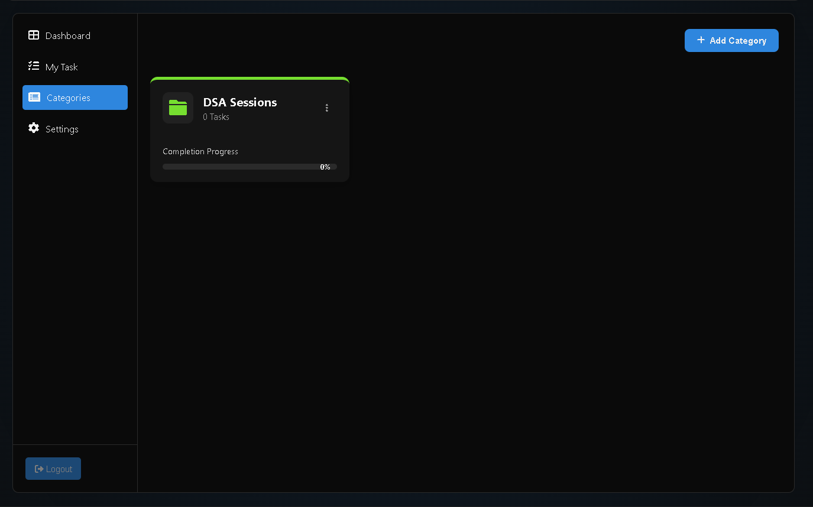
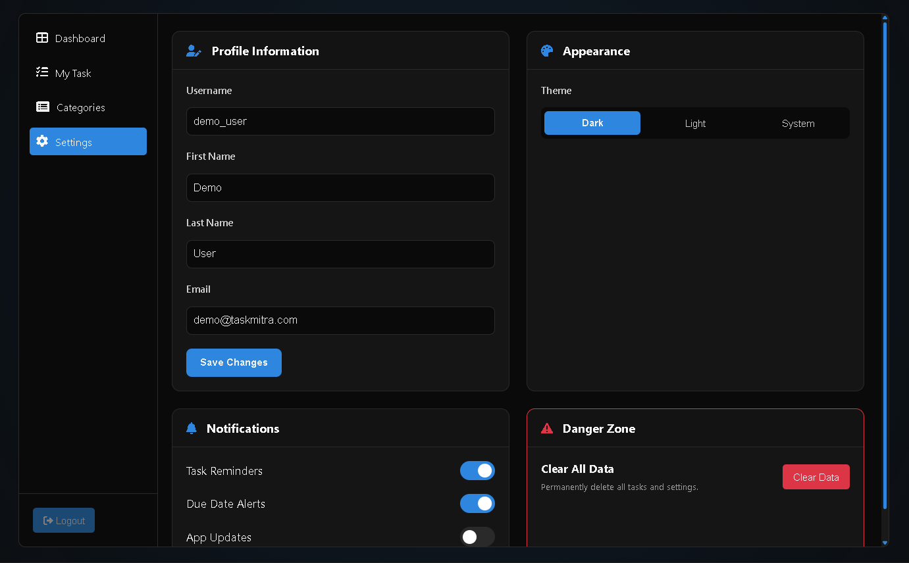

<div align="center">

  

  <h1 style="margin-top: 20px;">✅ TaskMitra — Smart Task Management</h1>

  <h3>
    🚀 A Modern Task Management System
  </h3>

  <p>
    
    
    
    
    
    
  </p>

  <p><strong>
    A sleek, fully responsive task management application built with Django featuring 
    dynamic task organization, category management, and an intuitive user interface.
  </strong></p>

</div>

---

## 📚 Documentation

<div align="center">

| 📖 [About Project](ABOUT.md) | 🚀 [Setup Guide](SETUP.md) | 🔌 [API Docs](API.md) |
|:---:|:---:|:---:|
| **Learn about features & design** | **Installation & configuration** | **API endpoints & integration** |

| 🛡️ [Security](SECURITY.md) | 📁 [Project Structure](STRUCTURE.md) | 🤝 [Contributing](CONTRIBUTING.md) |
|:---:|:---:|:---:|
| **Security features & best practices** | **File organization & architecture** | **Contribution guidelines** |

</div>

---

## ✨ Key Features

- **🎨 Modern Dark Theme UI** - Sleek interface with blue accent colors
- **📱 Fully Responsive Design** - Optimized for all devices
- **⚡ Real-time Updates** - AJAX-powered operations without page refresh
- **🏷️ Category Management** - Organize tasks with color-coded categories
- **🎯 Priority & Status Tracking** - High/Medium/Low priorities with completion states
- **🔍 Advanced Filtering** - Filter by priority, status, category, and due date
- **🛡️ Security First** - CSRF protection, XSS prevention, secure headers
- **🔐 Demo Authentication** - Quick testing with auto-login (dev mode)

---

## 📱 Screenshots

<div align="center">
  <table>
    <tr>
      <td width="50%">
        
        <p align="center"><b>Dashboard - Task Overview</b></p>
      </td>
      <td width="50%">
        
        <p align="center"><b>My Tasks - Grid View</b></p>
      </td>
    </tr>
    <tr>
      <td width="50%">
        
        <p align="center"><b>Task Categories</b></p>
      </td>
      <td width="50%">
        
        <p align="center"><b>Settings Panel</b></p>
      </td>
    </tr>
  </table>
</div>

---

## 🛠️ Tech Stack

<div align="center">

| Technology | Version | Purpose |
|:-----------|:--------|:--------|
| **Python** | 3.13.5 | Backend programming language |
| **Django** | 5.2.6 | Web framework |
| **SQLite** | 3.x | Database |
| **HTML5** | - | Structure & markup |
| **CSS3** | - | Styling & animations |
| **JavaScript** | ES6+ | Interactivity & AJAX |

</div>

---

## 🚀 Quick Installation

```bash
# Clone repository
git clone https://github.com/logicbyroshan/smart-tasks-manager.git
cd smart-tasks-manager

# Create virtual environment
python -m venv venv
venv\Scripts\activate  # Windows
# source venv/bin/activate  # macOS/Linux

# Install dependencies
pip install -r requirements.txt

# Run migrations
python manage.py migrate

# Start development server
python manage.py runserver
```

Visit `http://127.0.0.1:8000/` — You'll be automatically logged in as `demo_user`.

> **📖 For detailed setup instructions, see [SETUP.md](SETUP.md)**

---

## 📖 Usage

### **Adding Tasks**
1. Click **"Add Task"** button
2. Fill in task details (title, category, priority, due date)
3. Click **"Add Task"** to save

### **Managing Categories**
1. Navigate to **Categories** page
2. Click **"Add Category"**
3. Choose name and color
4. Assign to tasks for organization

### **Filtering & Search**
- Use filter bar on **My Tasks** page
- Filter by priority, status, or category
- Search by task title or description

> **📖 For complete usage guide, see [ABOUT.md](ABOUT.md)**

---

## 🔧 Configuration

### **Key Settings** (`config/settings.py`)

```python
# Demo Authentication (Development Only)
MIDDLEWARE = [
    # ...
    'todo.middleware.DemoAuthMiddleware',  # Remove in production
]

# Database
DATABASES = {
    'default': {
        'ENGINE': 'django.db.backends.sqlite3',
        'NAME': BASE_DIR / 'db.sqlite3',
    }
}

# Static Files
STATIC_URL = '/static/'
STATICFILES_DIRS = [BASE_DIR / 'static']
```

> **🛡️ For production settings, see [SECURITY.md](SECURITY.md)**

---

## 🤝 Contributing

Contributions are welcome! Please follow these steps:

1. Fork the repository
2. Create your feature branch (`git checkout -b feature/AmazingFeature`)
3. Commit your changes (`git commit -m 'feat: Add some AmazingFeature'`)
4. Push to the branch (`git push origin feature/AmazingFeature`)
5. Open a Pull Request

> **📖 For detailed guidelines, see [CONTRIBUTING.md](CONTRIBUTING.md)**

---

## 📄 License

This project is licensed under the **MIT License** — see the LICENSE file for details.

---

## 👨‍💻 Author

**Developed with ❤️ by Roshan**

- GitHub: [@logicbyroshan](https://github.com/logicbyroshan)
- Repository: [smart-tasks-manager](https://github.com/logicbyroshan/smart-tasks-manager)

---

## 🙏 Acknowledgments

- Django Framework for the robust backend
- Font Awesome for beautiful icons
- Community contributors for valuable feedback

---

<div align="center">
  <p>Made with ❤️ using Django</p>
  <p>⭐ Star this repository if you find it helpful!</p>
  
  <p>
    <a href="ABOUT.md">About</a> •
    <a href="SETUP.md">Setup</a> •
    <a href="API.md">API</a> •
    <a href="SECURITY.md">Security</a> •
    <a href="STRUCTURE.md">Structure</a> •
    <a href="CONTRIBUTING.md">Contributing</a>
  </p>
</div>
